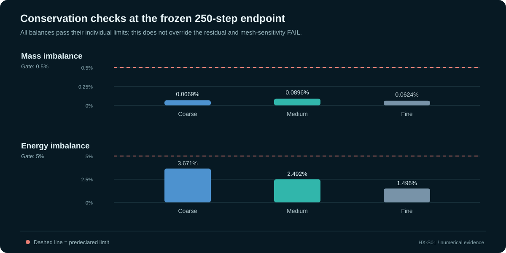

# HX-S01: source-informed synthetic PCHE study

**Disposition: NUMERICAL FAIL.** This is a source-informed synthetic study, not a blind benchmark and not experimental validation.

## Executive summary

The original publication-targeted HX-B01 path stopped before solver execution because the available source information did not establish a matched pointwise experimental target for the reconstructed case. With the owner's approval, Aero proceeded with a separate synthetic replacement rather than inventing experimental measurements. HX-S01 uses a real printed-circuit heat exchanger (PCHE) publication to ground configuration and operating context, declares the remaining assumptions, and evaluates a first-principles screen and an OpenFOAM conjugate-heat-transfer (CHT) workflow against predeclared numerical gates.

At the frozen 250 pseudo-iteration endpoint, all three mesh levels completed to the requested horizon, but none met the residual limit. The medium-to-fine pressure-drop differences were 22.17% on the cold side and 22.61% on the hot side, above the frozen 5% mesh-sensitivity limit. Mass and energy balances and the retained `checkMesh` gate passed. The overall numerical disposition is **FAIL**.

Optional same-settings continuations of all three grids reached iteration 1,000 and still failed the residual gate. Heat-duty snapshots rose by about 196-203% from iteration 250, showing that the earlier fields were not settled. The fine case resumed from its archived iteration-275 checkpoint with unchanged mesh, physics, and numerical settings. These diagnostics do not alter the frozen baseline.

## Why the replacement is synthetic

Samarmad and Jaffal (2023) describe a two-way-corrugated PCHE and provide useful geometry and operating context. The reconstructed solver condition could not be matched to a verified pointwise experimental data set. The source also gives a cold-inlet temperature of 290 K in one location and 293 K in another, while complete structural material and boundary inputs are not available. The study therefore makes the minimum runnable case explicit rather than fabricating measurements or calling calculated values experimental truth.

The publisher states that data will be made available on request. A matched pointwise package was not obtained for this execution; this replacement does not claim the data can never be obtained. A custodian-led data request may reopen HX-B01 under its existing source and blinding gates.

The configuration is grounded in the real paper; it is not a reproduction of the authors' CAD. The case uses the 5 mm manufactured pitch rather than a 4 mm numerical-width statement. The 0.8 mm corrugation amplitudes and 12.6 mm wavelength are interpreted from a table whose units are not stated. The detailed boundary/loop description's 293 K cold inlet is used without claiming that it resolves the source discrepancy. A velocity of 0.246 m/s is the low end of a reported CFD range, not a matched experimental point.

Water properties are fixed at nominal values near 308.15 K; temperature dependence is omitted. The source's aluminum thermal conductivity is used, but density and heat capacity are declared thermal completions. The plate is not a verified alloy or structural material. Headers and collectors are omitted, and the outer solid boundary is adiabatic. The public case register records these choices in machine-readable form.

The published article and its figures, tables, and prose are not copied into the public package. The source-use record identifies the consulted author-uploaded copy as CC BY-NC-ND 4.0; attribution and noncommercial reference use were recorded, while commercial reuse was not cleared. This is a source-custody disclosure, not legal advice.

## Case and analytical screen

The reconstructed unit is one periodic hot/cold channel pair with a solid plate: 0.24 m active length, 5 mm pitch width, and a semicircular 2.5 mm channel. Counter-current water enters at 323 K and 293 K, respectively, with speed magnitude 0.246 m/s. Fluid properties are constant. The OpenFOAM Foundation v10 solver is `chtMultiRegionFoam` with hot-fluid, cold-fluid, and solid-plate regions.

An independent first-principles screen treats the channel as a straight, fully developed semicircular duct. It gives hydraulic diameter 1.52754 mm, Reynolds number 519.12, and straight-duct pressure drop 576.20 Pa. Two fully developed Nusselt asymptotes yield an idealized counterflow duty screen of 27.46-30.90 W per channel pair. This is not an uncertainty interval, acceptance target, or prediction for the corrugated geometry; it omits developing flow, corrugation-driven secondary motion, and headers/collectors.

## Frozen numerical gates and 250-iteration results

The retained criteria were not relaxed after execution:

| Gate | Frozen requirement |
|---|---:|
| Maximum final equation residual | <= 1e-6 on every grid |
| Inlet/outlet mass imbalance | <= 0.5% |
| Hot/cold energy imbalance | <= 5% |
| Medium-to-fine change in pressure drop, heat duty, and outlet temperature | <= 5% |
| Mesh topology | `checkMesh` passes for every region and grid |

| Grid | Cells | Max final residual | Mass imbalance | Energy imbalance | Hot / cold pressure drop |
|---|---:|---:|---:|---:|---:|
| Coarse | 494,670 | 2.1375e-4 **FAIL** | 0.0669% | 3.671% | 1,319.4 / 1,340.9 Pa |
| Medium | 1,003,677 | 5.7688e-6 **FAIL** | 0.0896% | 2.492% | 1,393.7 / 1,407.9 Pa |
| Fine | 2,770,939 | 6.6989e-6 **FAIL** | 0.0624% | 1.496% | 1,800.9 / 1,808.9 Pa |

The mass and energy balances are inside their limits. Pressure drop is not mesh-independent under the predeclared comparison: medium-to-fine changes are 22.61% hot and 22.17% cold. The basic `checkMesh` gate passes. One medium-grid hot-fluid log records a face at 70.103 degrees while still reporting `Mesh OK`; a generated setup-manifest sentence claiming all meshes failed an additional frozen mesh-quality gate is unsupported by the retained acceptance criteria and logs. The original manifest was preserved, and this discrepancy is documented in the report.

| Same-settings diagnostic | Endpoint | Max final residual | Hot / cold pressure drop | Hot duty | Cold duty | Mass / energy imbalance |
|---|---|---:|---:|---:|---:|
| Coarse | 1,000; normal end | 2.8482e-4 **FAIL** | 1,318.63 / 1,342.31 Pa | 6.661 -> 20.134 W (+202.3%) | 6.915 -> 20.638 W (+198.5%) | 0.0667% / 2.443% |
| Medium | 1,000; normal end | 1.8094e-6 **FAIL** | 1,394.24 / 1,406.88 Pa | 6.844 -> 20.428 W (+198.5%) | 7.019 -> 20.799 W (+196.3%) | 0.0884% / 1.782% |
| Fine | 1,000; normal end after resume from archived 275 field | 1.9805e-6 **FAIL** | 1,794.72 / 1,802.36 Pa | 6.722 -> 20.097 W (+199.0%) | 6.824 -> 20.533 W (+200.9%) | 0.0625% / 2.123% |

At 1,000, fine-to-medium pressure-drop differences are 28.7% hot-side and 28.1% cold-side. Heat-duty values are more closely grouped (hot: 20.097-20.428 W; cold: 20.533-20.799 W), but that quantity-specific clustering does not cure pressure-drop disagreement or residual failure. A normal solver end marker is not convergence, grid independence, or validation. The frozen 250 result remains NUMERICAL FAIL.

## What this study establishes

- Aero case tooling supported a declared source-informed case through analytical screening, independent parametric geometry, three-region OpenFOAM CHT, post-processing, and numerical-gate evaluation.
- The frozen acceptance logic preserved a numerical failure instead of treating a completed process as success.
- The geometry and mesh identity records are consistent; their hashes establish artifact identity, not fidelity to the paper's CAD or scientific validity.
- Execution was Codex-supervised and human-orchestrated. Local conversational-model autonomy was **not evaluated**.

## What it does not establish

No experimental comparison, experimental accuracy, PCHE-specific CalculiX result, structural material allowable, wall-resolution qualification, design readiness, or blind performance is claimed. HX-S01 does not complete or overwrite HX-B01 and does not close HX-B02 through HX-B05 or HX-D01.

## Public data and retained evidence

- [Declared case inputs and assumptions](study_definition.json)
- [First-principles screening summary](first_principles_screen.json)
- [Frozen 250-iteration numerical gate summary](baseline_gate_assessment.json)
- [Optional continuation summary](continuation_diagnostic.json)
- [Fine 1,000-iteration post-processing record](fine_1000.json)
- [Archived fine 275 checkpoint summary](fine_275_partial.json)
- [Geometry and mesh identity hashes](geometry_identity.json)
- [Evidence hash register](evidence_manifest.json)

The complete local evidence manifest hashes the solver logs, post-processing records, setup/continuation receipts, and mesh files retained on the owner's machine. The public site publishes the report and sanitized summary records, not the 200+ MB mesh binaries or raw runtime logs. No trusted external timestamp is claimed. SHA-256 hashes identify files relative to their recorded values; they do not certify validity.

## References

1. Samarmad, A. O., and Jaffal, H. M. (2023). “Performance evaluation of a printed circuit heat exchanger with a novel two-way corrugated channel.” *Results in Engineering*, 19, 101303. [DOI: 10.1016/j.rineng.2023.101303](https://doi.org/10.1016/j.rineng.2023.101303). Used for configuration and input context only; no publication result is used as HX-S01 truth.
2. Seo, J.-W., Kim, Y.-H., Kim, D., Choi, Y.-D., and Lee, K.-J. (2015). “Heat Transfer and Pressure Drop Characteristics in Straight Microchannel of Printed Circuit Heat Exchangers.” *Entropy*, 17(5), 3438-3457. [DOI: 10.3390/e17053438](https://doi.org/10.3390/e17053438). Method/context reference only.
3. Hruby, J., Patek, J., Klomfar, J., Souckova, M., and Harvey, A. H. (2009). “Reference Correlations for Thermophysical Properties of Liquid Water at 0.1 MPa.” *Journal of Physical and Chemical Reference Data*, 38(1). [NIST publication record](https://www.nist.gov/publications/reference-correlations-thermophysical-properties-liquid-water-01-mpa).
